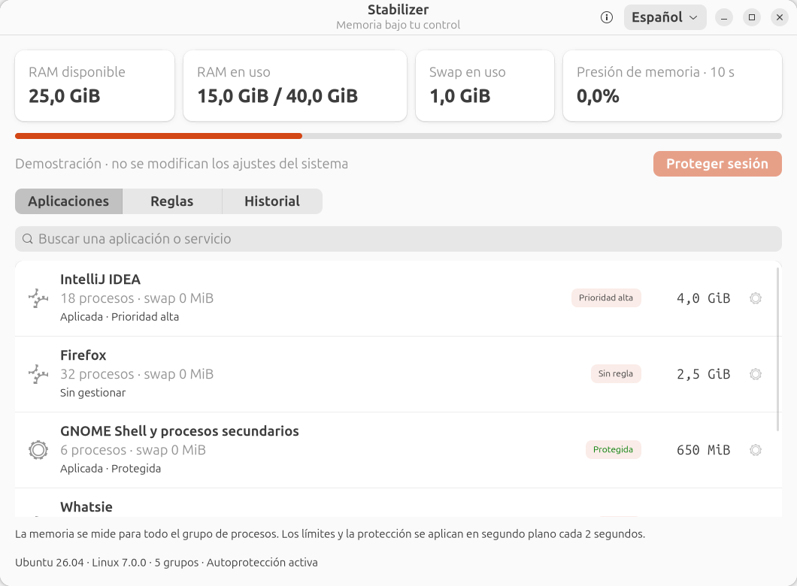

# Stabilizer

Monitor nativo de memoria y gestión de prioridades para **Ubuntu 26.04 / Linux 7.0+**.

[English](README.md) · [Русский](README.ru.md) · [Licencia](LICENSE)



## Funciones

- Interfaz GTK4/libadwaita escrita en Rust, con un agente de usuario asíncrono.
- Inglés, español y ruso; selector en la cabecera, elección persistente y menú de la bandeja traducido.
- RAM, memoria disponible, swap y presión de memoria (PSI).
- Contabilidad de memoria por grupos de procesos, incluidos los procesos secundarios.
- Prioridades: protegida, alta y normal; límites flexibles opcionales.
- Reglas persistentes, verificación de atributos cgroup y restauración de los ajustes anteriores.
- Icono en la bandeja: un clic muestra la información principal y permite abrir la ventana.
- Autoprotección del agente frente a systemd-oomd y reinicio automático tras una finalización inesperada.

## Instalación

Descarga el paquete amd64 y su suma de comprobación desde [Releases](https://github.com/topwebmaster/stabilizer/releases).

```sh
sha256sum -c stabilizer_0.1.0_amd64.deb.sha256
sudo apt install ./stabilizer_0.1.0_amd64.deb
```

Abre Stabilizer en el menú de aplicaciones y elige **Español** en la cabecera.
Al cerrar la ventana, el agente, la bandeja y las reglas siguen funcionando.
El idioma inicial se determina a partir del sistema; si no es compatible, se utiliza inglés.

Requisitos: Ubuntu 26.04, Linux 7.0 o posterior, systemd 259 o posterior y cgroups v2.
La primera versión está probada en amd64 con la sesión GNOME estándar de Ubuntu.
La bandeja necesita la extensión Ubuntu AppIndicators, incluida en la sesión estándar.

## Alcance de la protección

La protección excluye un grupo apto de la selección de **systemd-oomd**. No impide
la finalización por el OOM killer del núcleo, un cierre manual, una caída del
programa o el cierre de la sesión. Un límite flexible puede ralentizar la aplicación
y generar presión de memoria; no se permite asignarlo a una aplicación protegida.

La autoprotección utiliza una unidad de usuario independiente con `ManagedOOMPreference=omit`
y `Restart=always`. El propietario puede detenerla de forma deliberada:

```sh
systemctl --user stop stabilizer-agent.service
```

Una parada deliberada no provoca un reinicio automático. Stabilizer no intenta
impedir que el propietario administre o desinstale el programa.

## Compilación y comprobaciones

En Ubuntu 26.04 con Rust 1.92 o posterior:

```sh
sudo apt install build-essential pkg-config libgtk-4-dev libadwaita-1-dev python3
cargo build --locked -j 2
cargo run --locked --bin stabilizer
./scripts/build-deb.sh
```

La ejecución desde el código crea `stabilizer-agent-dev.service` para el agente.
Las instrucciones completas, las pruebas y las limitaciones se encuentran en el
[README en inglés](README.md).

## Licencia

El código fuente está disponible bajo la **Stabilizer Source-Available License 1.0 — No Resale**.
Se permiten el uso personal, el uso interno en empresas, las modificaciones y la distribución
gratuita. La venta de copias, la redistribución de pago, las sublicencias de pago y la inclusión
de copias originales o modificadas en productos o paquetes de software de pago requieren
permiso escrito del titular. Se permiten servicios reales de soporte e instalación separados
de la venta del programa. Las dependencias conservan sus propias licencias.

La restricción de reventa no es compatible con la definición de Open Source de OSI;
el proyecto se identifica como **source-available**. El texto de [LICENSE](LICENSE)
en inglés es el texto normativo.
