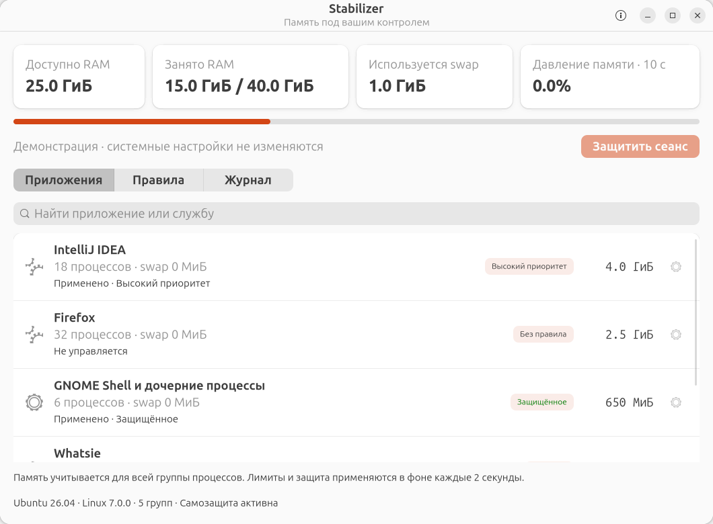

# Stabilizer

Native memory monitoring and application protection for **Ubuntu 26.04 / Linux 7.0+**.

Built with Rust, GTK4 and libadwaita. A small user-session agent keeps policies active
while the main window is closed. No Electron, WebView, root daemon, telemetry or
independent process killer.

[Русский](README.ru.md) · [License](LICENSE) · [Contributing](CONTRIBUTING.md)



## Features

- Live RAM, available memory, swap and memory-pressure (PSI) statistics.
- Per-application cgroup accounting including child processes.
- Persistent priorities: **Protected**, **High**, **Normal**.
- Optional soft memory limits, reversible changes and verified cgroup attributes.
- Session protection for D-Bus and GNOME Shell, with explicit effectiveness status.
- Native system tray: click for a live summary, double/middle-click support depends
  on the desktop; use **Open Stabilizer** in the menu to open the main window.
- The agent is excluded from systemd-oomd candidates and automatically restarted
  after an unexpected termination when running in its dedicated systemd user unit.
- Local, atomic settings storage and a bounded history of policy actions.

## Download and install

Get the amd64 `.deb` and checksum from [Releases](https://github.com/topwebmaster/stabilizer/releases).

```sh
sha256sum -c stabilizer_0.1.0_amd64.deb.sha256
sudo apt install ./stabilizer_0.1.0_amd64.deb
```

Open **Stabilizer** in the applications menu. The background agent starts through
D-Bus activation; it is also configured to start at the next login. Closing the
window frees GUI resources while the tray and policies remain active.

Supported runtime: Ubuntu 26.04, Linux >= 7.0, systemd >= 259, cgroups v2. The
initial release is tested on amd64 with the default Ubuntu GNOME session. Other
Debian-based distributions are not supported by version 0.1. GNOME requires the
Ubuntu AppIndicators extension (enabled in the standard Ubuntu session) for the
tray. The agent still works if the tray host is unavailable.

## What protection means

**Protected** excludes a verified eligible cgroup from `systemd-oomd` selection.
**High** asks oomd to prefer other eligible candidates. This does not prevent the
kernel OOM killer, a manual kill, a session shutdown, or a program's own crash.
Root administrators and the owning user can deliberately stop the service:

```sh
systemctl --user stop stabilizer-agent.service
```

Crash recovery does not undo an explicit systemd stop. Stabilizer is not an
unremovable or tamper-proof service. Low-memory recovery still requires enough
resources to restart the agent. The development unit is named
`stabilizer-agent-dev.service`.

Preferences are not recursive. Version 0.1 does not claim effective protection
for nested cgroups or indivisible OOM ancestor groups. It checks ownership and
ancestor policies; root-owned monitoring may ignore user preferences. The UI
shows unconfirmed protection instead of promising safety in these cases.

A soft memory limit can slow an application and create memory pressure. It is
therefore unavailable for protected applications. No hard memory limit or
automatic app termination is enabled by Stabilizer.

## Build

On Ubuntu 26.04 with Rust >= 1.92:

```sh
sudo apt install build-essential pkg-config libgtk-4-dev libadwaita-1-dev python3
cargo build --locked -j 2
cargo run --locked --bin stabilizer
./scripts/build-deb.sh
```

A development launch creates a dedicated user unit for the sibling agent binary,
so that tray monitoring and crash recovery work without installing the package.
To stop it: `systemctl --user stop stabilizer-agent-dev.service`.

Read-only diagnostics:

```sh
cargo run --locked --no-default-features --bin stabilizer-agent -- --check
cargo run --locked --no-default-features --bin stabilizer-agent -- --once
```

`stabilizer --demo` displays sample data with system actions disabled.

## Tests

```sh
cargo fmt --check
cargo clippy --locked --all-targets -- -D warnings
cargo test --locked --no-default-features
python3 scripts/live-smoke.py --release
python3 scripts/tray-smoke.py
```

The two live smoke scripts require a real Ubuntu user session and no running
Stabilizer agent. They operate on dedicated temporary services only. They never
fill the host RAM or change GNOME/D-Bus policies. CI compiles and tests inside an
Ubuntu 26.04 container; it does not claim to validate a real GNOME session or OOM
victim selection under exhausted host memory.

## State and uninstall

Settings: `${XDG_STATE_HOME:-$HOME/.local/state}/stabilizer/state.json` (0600).
No application command lines or network telemetry are collected. Installed
desktop-entry names and executable paths are used locally to identify groups.

Remove policies in the **Rules** tab before uninstalling if you want to restore
managed settings immediately. Changes made by other tools are preserved. Stop
the agent and uninstall the package using the system package manager. User state
is retained; already-applied runtime settings may remain until the affected unit
ends if you uninstall without removing its rules first.

## License

**Source-available, not OSI-approved Open Source.** The
[Stabilizer Source-Available License 1.0 — No Resale](LICENSE) allows personal and
internal business use, modification, and free redistribution. Selling copies,
paid sublicensing, or including original or modified copies in a paid software
product/bundle requires separate written permission. Paid support and
installation work remain permitted when the software itself is free.

Dependencies retain their original licenses; see [third-party notices](THIRD_PARTY_NOTICES.md).
